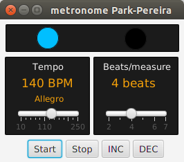
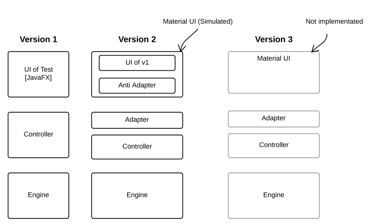
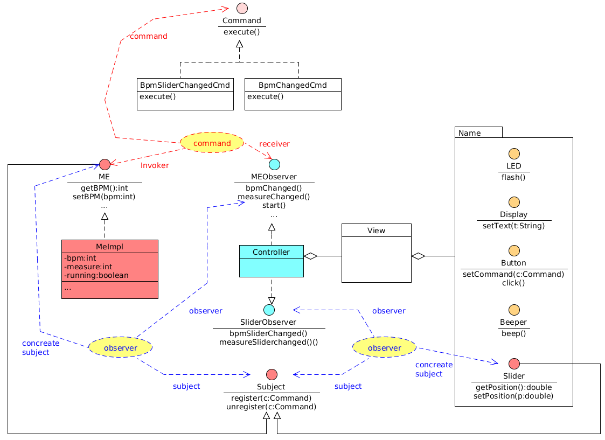
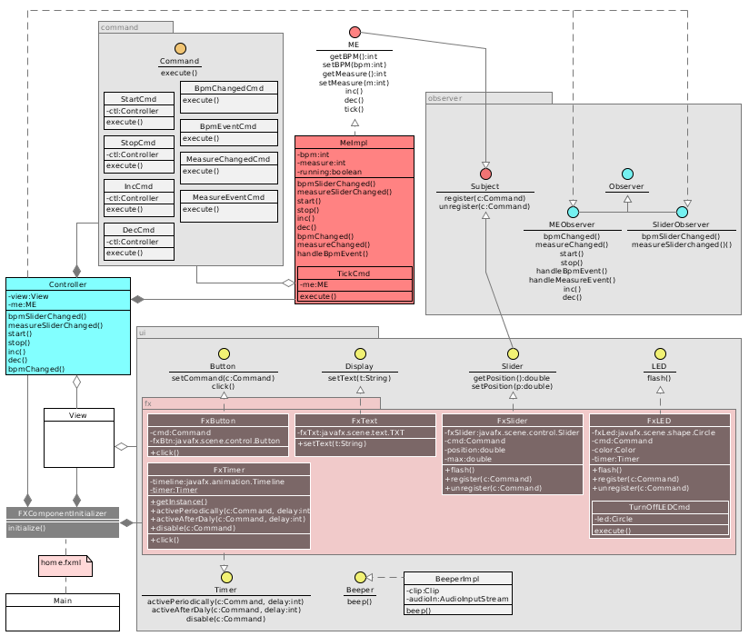

Metronome
===========================
Standalone JavaFX widget of Metronome

This is my AOC final TP which has `Command`, `Observer` and `Adapter` patterns.
There are two versions : 

### Version
1.0.0

1. Used design patterns.

2. Class diagram of Version 1.0.0

